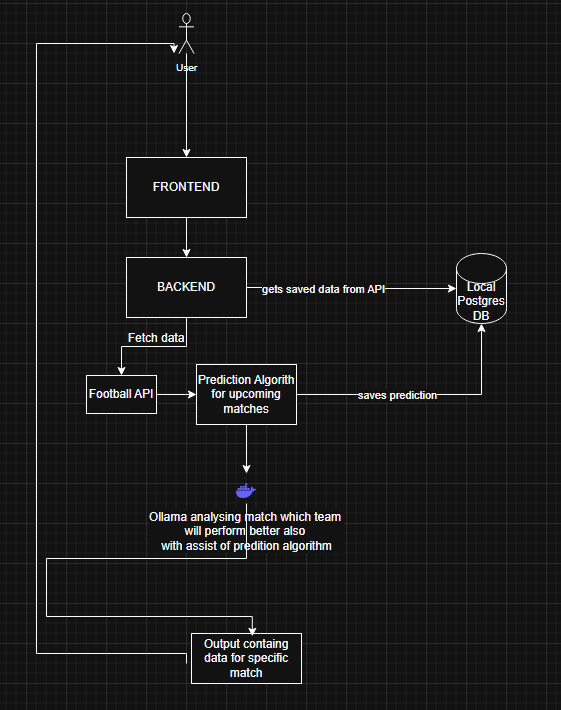

# Football Merchant



A brief one or two-paragraph description of what your project does, who it's for, and the problem it solves. Based on the name "Football Merchant", this could be an e-commerce platform for football-related merchandise or a data-driven application for football statistics and trading.

## Table of Contents

- [Tech Stack](#tech-stack)
- [Architecture](#architecture)
- [Prerequisites](#prerequisites)
- [Getting Started](#getting-started)
  - [Environment Variables](#environment-variables)
  - [Installation & Running](#installation--running)
- [API Endpoints](#api-endpoints)
- [Running Tests](#running-tests)
- [Contributing](#contributing)
- [License](#license)

## Tech Stack

### Frontend
- **Framework/Library:** [e.g., React, Angular, Vue.js]
- **Language:** [e.g., TypeScript, JavaScript]
- **Styling:** [e.g., CSS Modules, Styled-Components, Tailwind CSS]
- **Package Manager:** [e.g., npm, yarn]

### Backend
- **Framework/Library:** [e.g., Spring Boot, Node.js/Express, Django]
- **Language:** [e.g., Java, JavaScript/TypeScript, Python]
- **Database:** [e.g., PostgreSQL, MongoDB, MySQL]
- **Build Tool:** [e.g., Maven, Gradle, npm]

### DevOps
- **Containerization:** Docker, Docker Compose
- **CI/CD:** [e.g., GitHub Actions, Jenkins]

## Architecture

The diagram above shows the high-level architecture. The system is composed of several services working together:
- **Frontend Service:** A [React/Angular/Vue] application that provides the user interface.
- **Backend Service:** A [Spring Boot/Node.js] REST API that handles business logic and data persistence.
- **Database:** A [PostgreSQL/MongoDB] database to store application data.
- **[Other services...]**: [e.g., a message broker like RabbitMQ, a caching layer like Redis, etc.]

All services are containerized using Docker and orchestrated with Docker Compose for a consistent and easy-to-manage development environment.

## Prerequisites

Before you begin, ensure you have the following installed on your local machine:
- [Docker](https://www.docker.com/get-started) & [Docker Compose](https://docs.docker.com/compose/install/)
- [Git](https://git-scm.com/)
- [Node.js](https://nodejs.org/) (e.g., v18.x or later)
- [JDK](https://www.oracle.com/java/technologies/downloads/) (e.g., JDK 17 or later) & [Maven/Gradle](https://maven.apache.org/)

*Note: Node.js and JDK/Maven are only required if you intend to run the services outside of their Docker containers.*

## Getting Started

Follow these steps to get your development environment set up and running.

### Installation & Running

1.  **Clone the repository:**
    ```sh
    git clone [your-repository-url]
    cd football-merchant
    ```

2.  **Build and run with Docker Compose:**
    From the project root directory, execute:
    ```sh
    docker-compose up --build -d
    ```
    - `--build` forces a rebuild of the images if the Dockerfiles have changed.
    - `-d` runs the containers in detached mode (in the background).

3.  **Access the application:**
    - **Frontend:** `http://localhost:3000` (or the configured frontend port)
    - **Backend API:** `http://localhost:8080` (or the configured backend port)

4.  **To view logs:**
    ```sh
    docker-compose logs -f
    ```

5.  **To stop the application:**
    ```sh
    docker-compose down
    ```

## API Endpoints

Here is a sample structure for your API. For a complete and interactive API documentation, it's recommended to use a tool like Swagger/OpenAPI.

Link to Swagger/OpenAPI Docs (if available)

| Method | Endpoint              | Description                      |
|--------|-----------------------|----------------------------------|
| `GET`  | `/api/resource`       | Retrieves a list of resources.   |
| `GET`  | `/api/resource/{id}`  | Retrieves a single resource by ID.|
| `POST` | `/api/resource`       | Creates a new resource.          |
| `PUT`  | `/api/resource/{id}`  | Updates an existing resource.    |
| `DELETE`| `/api/resource/{id}` | Deletes a resource.              |

*Replace `resource` with your actual data model (e.g., `teams`, `players`).*

## License

Distributed under the [e.g., MIT] License. See `LICENSE` for more information.